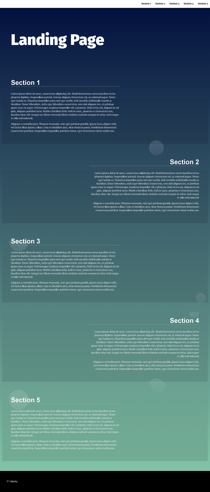

# Description

    This website is a single-page which is made to training on Manipulating the DOM
    like adding dynamically nav-links by Javascript and do some functions also.

## References

    - [FWD community](https://nfpdiscussions.udacity.com/latest)
    - [GitHub](https://github.com/islamCodehood/analyze/blob/master/README.md#react-app-hierarchy)
    - [MDN](https://developer.mozilla.org/en-US/docs/Web/API/Intersection_Observer_API)

### Brief about important files in my project

    -index.html
        -The HTML file of the project which is build the structure of the page.
    -style.css
        -The CSS file contains all design and animation of the project to make the page with clear design.
    -app.js
        -This is the controller file in the project which built Navigation dynamically as an unordered list, affect in the section which be in the your view port (Making it active) and some functions too.
    -README.md
        -My README file explain to you how to interact with the project and have some basic information.

#### How to run the project.

    Open index.html in browser window.

#### Screens

    
